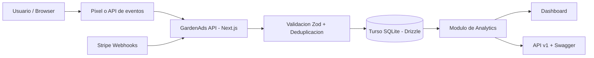
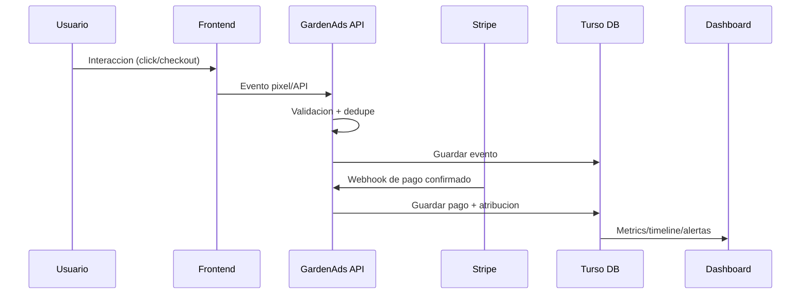

# GardenAds

Plataforma para conectar marketing y revenue real en ecommerce, usando Stripe como fuente de verdad.

## Que problema resuelve

Los equipos de crecimiento suelen tener diferencias entre lo que reportan Meta/Google y lo que realmente se cobra en Stripe.

Esta app unifica:

- Eventos de tracking (pixel/API).
- Confirmacion de pagos reales.
- Analitica accionable para optimizar campanas con datos confiables.

## Valor para negocio

- Reduce decisiones basadas en conversiones infladas o incompletas.
- Mejora la asignacion de presupuesto publicitario con revenue confirmado.
- Aporta visibilidad end-to-end del journey: click, evento, pago.
- Permite detectar rapido cuando se rompe el tracking.

## Valor para equipos tecnicos

- Backend en Next.js con rutas API versionadas (`/api/v1/...`).
- Validacion y tipado con TypeScript + Zod.
- Persistencia en Turso (SQLite) usando Drizzle ORM.
- Integracion con Stripe (webhooks y normalizacion de eventos).
- Documentacion de endpoints en Swagger/OpenAPI.

### Diagramas de alto nivel (Mermaid)





## Arquitectura funcional (resumen)

1. Se recibe un evento desde pixel o API.
2. El sistema valida payload y deduplica.
3. Se cruzan eventos con pagos confirmados de Stripe.
4. Se generan vistas de analytics, timeline y alertas para decisiones.

## Stack principal

### Frontend

- Next.js
- React
- TypeScript
- Tailwind CSS
- Radix UI

### Backend

- Next.js API Routes
- TypeScript
- Zod
- Drizzle ORM
- Turso (SQLite)
- Stripe

## Calidad y seguridad (plus del proyecto)

### QA Manual

Se trabajo con una matriz de QA manual para cubrir flujos criticos y validar comportamiento esperado de punta a punta.

Documento:
- [Planilla QA manual](https://docs.google.com/spreadsheets/d/1QXQxb6oCW3DLUq7ofZON_7rGCozPh0OL/edit?gid=16010566#gid=16010566)

Este artefacto permite:

- Trazabilidad de casos de prueba por modulo/flujo.
- Registro de resultados esperados vs resultados obtenidos.
- Seguimiento de estado, severidad y observaciones.
- Evidencia para regresion y validacion antes de release.

### Threat Modeling (TM) STRIDE

Se incorporo un enfoque de seguridad temprana con checklist STRIDE para identificar y mitigar riesgos antes de pasar a produccion.

Documento:
- [Checklist de seguridad STRIDE](https://notion.so/Checklist-de-seguridad-STRIDE-310265bd231280a4aad3d97b578297b8?source=copy_link)

El ejercicio cubre amenazas de:

- Spoofing
  - Auth/Session: endurecimiento de cookies seguras, proteccion CSRF y controles anti brute-force.
- Tampering
  - Webhooks: validacion de firma, idempotencia para evitar pagos/eventos duplicados y allowlist de tipos de evento.
- Repudiation
  - Registro/auditoria: trazabilidad de acciones y eventos para soporte de investigacion y no repudio.
- Information Disclosure
  - Privacidad/GDPR: manejo de PII e IP considerando compatibilidad IPv4 e IPv6.
- Denial of Service
  - Protecciones de tasa/abuso en endpoints criticos (auth, webhooks, tracking).
- Elevation of Privilege
  - Revisiones de permisos y controles de acceso por rol en modulos sensibles.
  - Validacion de input: enforcement de schema validation (Zod) en entradas expuestas.
  - Supply chain: auditoria de dependencias, secret scanning y CI checks de seguridad.

Este documento fortalece la postura de seguridad del producto y mejora la calidad del diseno tecnico desde etapas tempranas.

## Instalacion

### Clonar repositorio

```bash
git clone https://github.com/No-Country-simulation/S02-26-Equipo-03-Web-App-Development.git
cd S02-26-Equipo-03-Web-App-Development
```

### Instalar dependencias

```bash
pnpm install
```

### Variables de entorno

Crear `.env` basado en `.env.example` y completar credenciales necesarias (Stripe, Turso, auth).

### Ejecutar en desarrollo

```bash
pnpm dev
```

Abrir: [http://localhost:3000](http://localhost:3000)

### Scripts utiles

- `pnpm lint`
- `pnpm build`
- `pnpm db:migrate`
- `pnpm db:seed`
- `pnpm db:clean`

## Equipo S02-26-E03

<table align="center">
  <tr>
    <th>Nombre</th>
    <th>Rol</th>
    <th>GitHub</th>
    <th>LinkedIn</th>
  </tr>

  <tr align="center">
    <td>Brahian Pereyra</td>
    <td>Arquitecto de Software</td>
    <td>https://github.com/brahianpdev</td>
    <td>https://www.linkedin.com/in/brahianpdev/</td>
  </tr>

  <tr align="center">
    <td>Hernan Cassasola</td>
    <td>Teach Lead</td>
    <td>https://github.com/GuidoMaxier</td>
    <td>https://www.linkedin.com/in/hernan-casasola/</td>
  </tr>

  <tr align="center">
    <td>Ivan Rovner</td>
    <td>Project Manager</td>
    <td>https://github.com/rovnerivan</td>
    <td>https://www.linkedin.com/in/ivanjoelrovner/</td>
  </tr>

  <tr align="center">
    <td>Rocio Dietz</td>
    <td>DevOps</td>
    <td>https://github.com/DietzRocio</td>
    <td>https://www.linkedin.com/in/dietz-rocio/</td>
  </tr>

  <tr align="center">
    <td>Sebastian Castro</td>
    <td>QA</td>
    <td>https://github.com/ssebasss</td>
    <td>https://www.linkedin.com/in/</td>
  </tr>

  <tr align="center">
    <td>Ivan Andrade</td>
    <td>Diseñador UX UI</td>
    <td>https://www.behance.net/ivaanandrade</td>
    <td>https://www.linkedin.com/in/</td>
  </tr>

  <tr align="center">
    <td>Enmanuel Rodriguez</td>
    <td>Fullstack</td>
    <td>https://github.com/</td>
    <td>https://www.linkedin.com/in/</td>
  </tr>

  <tr align="center">
    <td>Mauro Laime</td>
    <td>Fullstack</td>
    <td>https://github.com/mauro-l</td>
    <td>https://www.linkedin.com/in/</td>
  </tr>

  <tr align="center">
    <td>Cristian Tortoza</td>
    <td>Fullstack</td>
    <td>https://github.com/cristiantortoza00</td>
    <td>https://www.linkedin.com/in/</td>
  </tr>

  <tr align="center">
    <td>Gianni Pasquinelli</td>
    <td>Frontend</td>
    <td>https://github.com/gianni03</td>
    <td>https://www.linkedin.com/in/gianni-pasquinelli</td>
  </tr>

  <tr align="center">
    <td>Scarlet Vargas</td>
    <td>Frontend</td>
    <td>https://github.com/scarletvargas</td>
    <td>https://www.linkedin.com/in/</td>
  </tr>

  <tr align="center">
    <td>Lautaro Durán</td>
    <td>Frontend</td>
    <td>https://github.com/LautaroLD</td>
    <td>https://www.linkedin.com/in/lautaro-duran/</td>
  </tr>

  <tr align="center">
    <td>Mariana Torres</td>
    <td>Backend</td>
    <td>https://github.com/TorresMariana</td>
    <td>https://www.linkedin.com/in/</td>
  </tr>

  <tr align="center">
    <td>Favian Medina</td>
    <td>Backend</td>
    <td>https://github.com/fabinnerself</td>
    <td>https://www.linkedin.com/in/favian-medina-gemio/</td>
  </tr>

  <tr align="center">
    <td>Isabel Prudencio</td>
    <td>Backend</td>
    <td>https://github.com/belisabel</td>
    <td>https://www.linkedin.com/in/isabel-prudencio-nina-18615181/</td>
  </tr>

  <tr align="center">
    <td>Bruno Sosa</td>
    <td>Backend</td>
    <td>https://github.com/Bruno1084</td>
  <td>https://www.linkedin.com/in/brunos0sa/</td>
  </tr>
</table>
