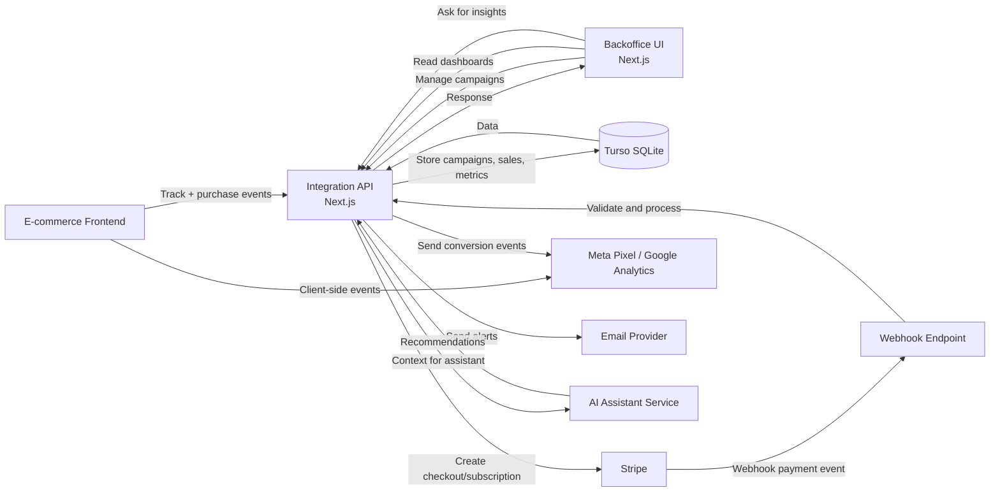
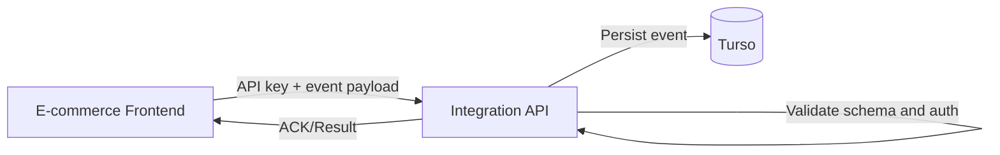
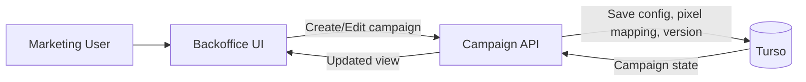
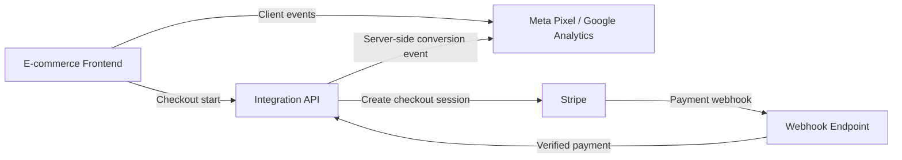
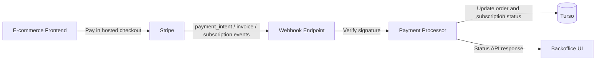
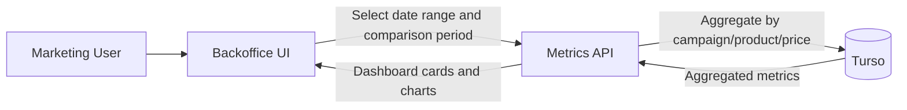
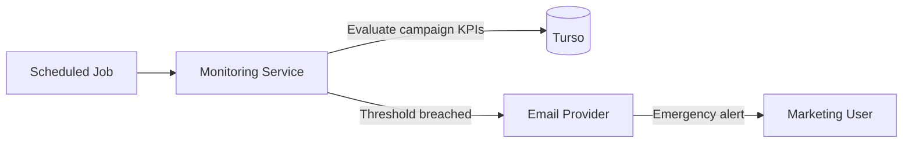
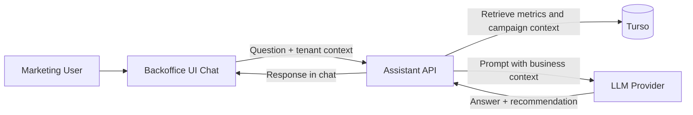
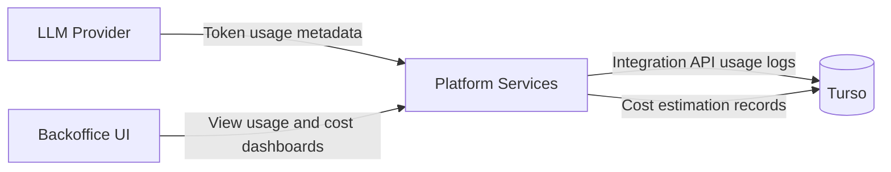

# Architecture

## Project Context

Producto objetivo: SaaS all-in-one para incorporación, impuestos y bookkeeping en USA.

Objetivo técnico del MVP: permitir que e-commerce integren nuestra API/pixel para medir conversiones reales de pagos Stripe y optimizar campañas en Google/Meta desde un backoffice.

## Scope (MVP con esteroides)

- Login y registro de cuentas cliente (e-commerce).
- Integración desde frontend del e-commerce a nuestra API.
- Definición y gestión de campañas (incluye versionado v1, v2, etc.).
- Uno o múltiples pixeles por campaña.
- Flujo de checkout/pago con Stripe y confirmación de estado.
- Métricas por campaña, producto y precio, con filtros por fecha y comparación de periodos.
- Notificaciones por correo para campañas con bajo rendimiento.
- Asistente virtual IA para soporte y análisis sobre datos del sistema.

## High-Level Diagram

## Diagram 1: E-commerce Integration Flow

## Diagram 2: Campaign Management Backoffice

## Diagram 3: Pixel and Conversion Attribution

## Diagram 4: Stripe Payment and Status Confirmation

## Diagram 5: Metrics, Filters and Period Comparison

## Diagram 6: Alerts for Low-Performance Campaigns

## Diagram 7: AI Virtual Assistant

## Diagram 8: Usage and Cost Tracking

